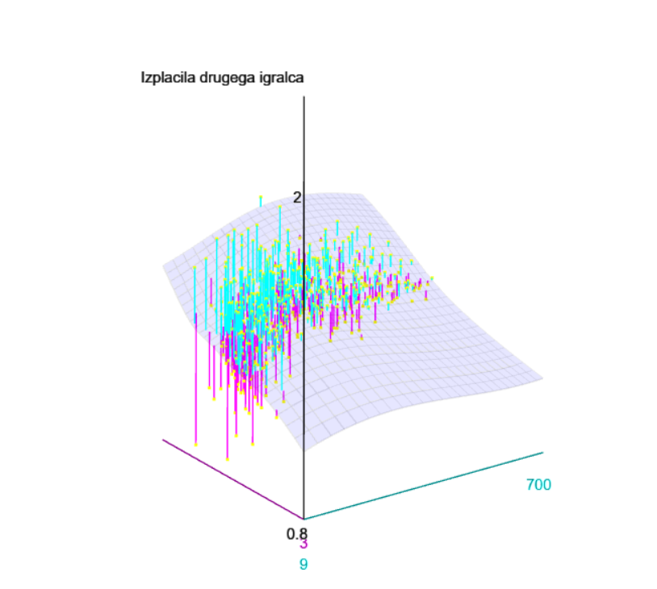
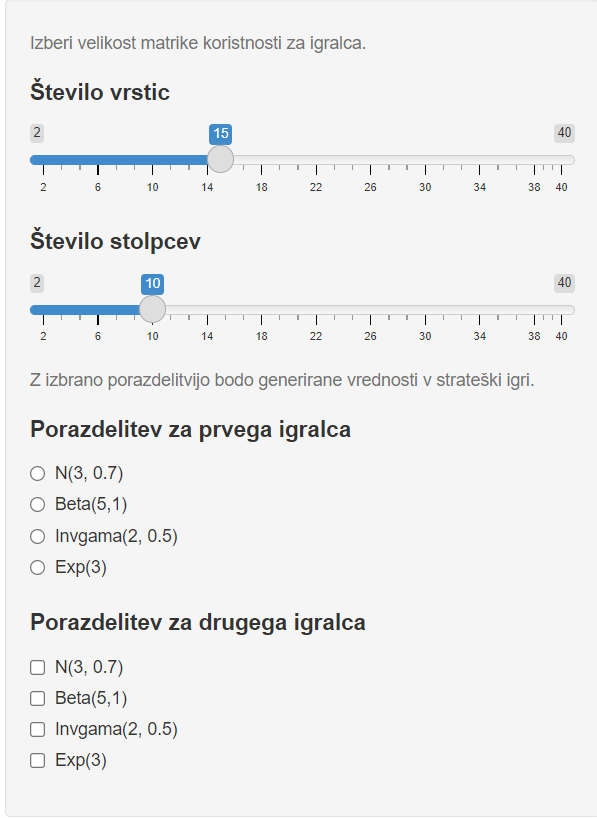

```{r setup, include=FALSE}
knitr::opts_chunk$set(echo = TRUE,
    message = FALSE,
    warning = FALSE)
```

## Uvod 

V teoriji iger je kooperativna igra oziroma Nasheva igra pogajanja, igra pri kateri skupine igralcev med seboj tekmuje. Pri tem si vsak igralec želi maksimizirati svojo koristnost U. Igralci med seboj lahko delujejo usklajeno in morda izmenjajo koristnosti. To je del pogodbe, ki določi stranska plačila. Če se igralca sporazumeta, dobi prvi x, drugi pa y, kjer je $(x, y) \in S$, $S \subseteq \mathbf{R}^2$ pa je množica dopustnih sporazumov. 

Lahko imamo  prenosljive dobrine in neprenosljive dobrine. Pri prenosljivih dobrinah so koristi igralcev med seboj neposredno primerljive in posledično lahko to koristnost igralci med seboj smiselno prenašajo. Dopustna množica je konveksna lupina ${(x - s,  y + s) \in S' : s \in \mathbf{R}}$, pri tem $s$ predstavlja stranska plačila. 

Imamo enostopensko in dvostopensko igro pogajanja. Pri enostopenski izhajamo iz pogajalskega izgodišča $(0,0)$, imenovan tudi status quo. Medtem ko pri dvostopenski igri, je status quo določen na podlagi grozilnih strategij posameznega igralca. Grozilna strategija je maximin startegija igralca. Z njo maksimiziramo verjetnost minimalnega profita. Če imamo igro za dva igralca ima prvi igralec maximin strategijo, medtem ko drugi minimax strategijo (minimizira verjetnost maksimalne izgube). To so bimatrične igre, kjer so izplačila in akcije predstavljene s pomočjo matrike. Vrednost igre je enaka 0. 

## Opis projekta 

Gledala bom bimatrične kooperativne igre, torej igre za dva igralca. Prvi bo imel akcije podane v vrsticah matrike, drugi pa v stolpcih. Analizirala bom samo igre s prenosljivimi dobrinami. Kot vem sporazum take igre vedno obstaja. Izhajala bom iz strateške igre. Matriki A in B bosta vsebovali vrednosti izplačil igralca ena in dva. Vrednosti le teh bodo simulirane s pomočjo štirih porazdelitev in sicer 
$$N(3, 0.7), \quad Beta(5,1), \quad Invgama(2, 0.5)\quad in \quad Exp(3).$$

Prvo bom simulirala enostopensko pogajanje, to pomeni da bo status quo v točki (0,0). Nato pa še dvostopensko igro, kjer bo status quo predstavljal grozilne strategija igralca. Pri obeh igrah bo funcija vrnila izplačila igralcev v igri. 

Analizirala bom izplačila posameznika v igri pri različnih porazdelitvah in glede na različno število akcij tj. velikost matrike. Celotna analiza bo predstavljena v aplikaciji. 


### Generiranje podatkov 

V datoteki $simulacija\_igre.R$ je predstavljena igra pogajanja. Kot prvo sem definirala funkcijo $matrika$, ki sprejme eno od zgornjih štirih porazdelitev in velikost matrike, ter vrne matriko vrednosti. S pomočjo te so generirane vrednosti bimatrične igre, kot razlika elemente matrike A in B, torej (A-B). Funkciji $enofazno\_pogajanje$ in $dvofazno\_pogajanje$, ki ju vidimo spodaj, vrneta vrednosti v Nashevem modelu pogajanja. Obe funkciji sta generirani tako, da najde presečišče z premico pod kotom 45 stopinj, ki leži na konveksni lupini, ter pravokotno premico, ki gre skozi točko quo. Pri dvofazni igri je status quo, določen s pomočjo maximin strategije (funkciji $minmax\_p$ in $minmax\_q$). 

```{r , echo=FALSE ,warning=FALSE}
library(hop)
library(invgamma)
library(matlib)
library(GameTheory)
library(lpSolve)
library(retistruct)
library(linprog)
library(rgl)
library(ggplot2)
library(dplyr)
library(ggpubr)


matrika <- function(porazdelitev, row, col){
  if(porazdelitev == 'norm'){
    return(matrix(rnorm(row * col, mean = 3, sd = 0.7), row, col))
  } 
  else if(porazdelitev == 'beta'){
    return(matrix(rbeta(row * col, 5, 1), row, col))
  }
  else if(porazdelitev == 'invgama'){
    return(matrix(rinvgamma(row * col, 2, 0.5), row, col))
  }
  else if(porazdelitev == 'exp'){
    return(matrix(rexp(row * col, 3), row, col))
  }
  
}

minmax_p <- function(A, B){ 
  org <- -t(A-B)
  #original
  vrstice <- nrow(org)
  stolpci <- ncol(org)
  modmat <- rbind(org, rep(1, stolpci))
  f.con <- cbind(modmat, c(rep(1, vrstice), 0), c(rep(-1, vrstice), 0))
  f.obj <- c(rep(0, stolpci), 1, -1)
  f.dir <- c(rep("<=", vrstice), "=")
  f.rhs <- c(rep(0, vrstice), 1)
  lin_prog <- lp ("max", f.obj, f.con, f.dir, f.rhs)

  return(lin_prog$solution)
  
}

minmax_q <- function(A, B){
  dual <- A-B 
  #dual 
  vrsticeD <- nrow(dual)
  stolpciD <- ncol(dual)
  modmatD <- rbind(dual, rep(1, stolpciD))
  d.con <- cbind(modmatD, c(rep(1, vrsticeD ), 0), c(rep(-1, vrsticeD ), 0))
  d.obj <- c(rep(0, stolpciD), 1, -1)
  d.dir <- c(rep('>=', vrsticeD), '=')
  d.rhs <- c(rep(0, vrsticeD), 1)
  lin_prog_d <- lp ("min", d.obj, d.con, d.dir, d.rhs)
  return(lin_prog_d$solution)

}
```


```{r , echo=TRUE ,warning=FALSE}
#enofazno pogajanje status quo je vedno tocka (0,0) 
enofazno_pogajanje <- function(A, B){
  SQ <- c(0, 0)
  Z <- A-B
  opt <- max(A+B)
  pos <- which(A+B == opt, arr.ind = TRUE)
  max_tocka <- c(A[pos[1],pos[2]], B[pos[1], pos[2]])
  xtop <- opt
  f <- function(x) x
  g <- function(x) opt - x
  sporazum <- line.line.intersection(c(0, f(0)), c(xtop, f(xtop)), max_tocka, c( 0, opt))
  return(round(sporazum,3))
}


#dvofazno pogajanje , status quo je tocka groznje, ki jo določimo s pomočjo maxmin strategije

dvofazno_pogajanje <- function(A, B){
  vek_q <- minmax_q(A,B)
  q <- vek_q[1:(length(vek_q)-2)]
  vek_p <- minmax_p(A,B)
  p <- vek_p[1:(length(vek_p)-2)]
  v_igre <- vek_p[length(vek_p)]
  tocka_groznje_1 <- t(p) %*% A %*% q
  tocka_groznje_2 <- t(p) %*% B %*% q
  SQ <- c(tocka_groznje_1, tocka_groznje_2)
 
  Z <- A-B
  opt <- max (A+B)
  g <- function(x) opt - x
  if (SQ[1] < SQ[2]){
    tocka2 <- c(0, SQ[2]-SQ[1])
  }else{
    tocka2 <- c(SQ[1]- SQ[2], 0)
  }
  sporazum <- line.line.intersection(c(0, g(0)), c(opt, g(opt)), c(SQ[1], SQ[2]), tocka2)
  return(round(sporazum, 3))
  
}
```

### Predstavitev podatkov

Analiza obeh iger je v datoteki $analiza\_payoff.R$. Velikost izplačil za posameznega igralca sem primerjala glede na dva parametra. In sicer glede na velikost matrike (število akcij), ter glede na različne zgoraj izbrane porazdelitve. 

1. Kot prvo imam zapisane funkcije, ki vrnejo primerjavo izplačil glede na število akcij in fiksne porazdelitve igralcev. Pri tem sami določimo maksimalno velikost, graf pa nam pokaže izplačila vseh matrik do izbrane velikosti. 
Za matrike manjše od 10x10, je to predstavljeno v grafu. Na primer, za dvofazno pogajanje za velikost matrike 5x7, prvi igralec igra s porazdelitvijo $N(3,0.7)$, drugi pa z $Beta(5,1).$ Pri tem je velikost matrik predstavljena kot produkt vrstic in stolpcev. Za boljšo primerjavo porazdelitev sem vzela povprečje 50-ih ponovitev igre. 

```{r, echo=FALSE}
povprecje_enofazna <- function(ponovitev, por1, por2, n, m){
  i <- 1
  vec_P1 <- c()
  vec_P2 <- c()
  while (i <= ponovitev){
    igra <- enofazno_pogajanje(matrika(por1, n,m), matrika(por2, n,m))
    vec_P1 <- append(vec_P1, igra[1])
    vec_P2 <- append(vec_P2, igra[2])
    i <- i+ 1
    
  }
  return(c(round(mean(vec_P1),3),round(mean(vec_P2),3)))
}

povprecje_dvofazne <- function(ponovitev, por1,por2, n, m){
  i <- 1
  vec_P1 <- c()
  vec_P2 <- c()
  while (i <= ponovitev){
    igra <- dvofazno_pogajanje(matrika(por1, n,m), matrika(por2, n,m))
    vec_P1 <- append(vec_P1, igra[1])
    vec_P2 <- append(vec_P2, igra[2])
    i <- i+ 1
    
  }
  return(round(c(mean(vec_P1),3), round(mean(vec_P2),3)))
}

enofazna_enaka_por <- function(por1, por2, n, m){ 
  payoff_matrika <- as.data.frame(matrix(NA, nrow =(n-1) *(m - 1)*2, ncol = 3))
  stevec <- 1
  i <- 2
  while (i <= n){
    j <-2
    while (j <= m){
      izracun <- povprecje_enofazna(50, por1, por2, n, m)
      payoff_matrika[stevec,] <- cbind(i * j,'igralec1', izracun[1])
      payoff_matrika[stevec + 1,] <- cbind(i * j, 'igralec2', izracun[2])
      
      j <- j+1
      stevec <- stevec +2
    }
    i <- i +1
  }
  colnames(payoff_matrika)<- c('velikost_matrike', 'igralec', 'Vrednost')
  return(payoff_matrika)
}


dvofazna_enaka_por <- function(por1, por2, n, m){ 
  payoff_matrika <- as.data.frame(matrix(NA, nrow =(n-1) *(m - 1)*2, ncol = 3))
  stevec <- 1
  i <- 2
  while (i <= n){
    j <-2
    while (j <= m){
      izracun <-  dvofazno_pogajanje(matrika(por1, n,m), matrika(por2, n, m))
      payoff_matrika[stevec,] <- cbind(i * j,'igralec1', izracun[1])
      payoff_matrika[stevec + 1,] <- cbind(i * j, 'igralec2', izracun[2])
      
      j <- j+1
      stevec <- stevec +2
    }
    i <- i +1
  }
  colnames(payoff_matrika)<- c('velikost_matrike', 'igralec', 'Vrednost')
  return(payoff_matrika)
}
```

```{r , echo=FALSE ,warning=FALSE}
dat <- dvofazna_enaka_por('norm', 'beta', 5, 7)
ggplot(data = dat) +
    geom_point(aes(x = velikost_matrike, y = Vrednost, 
                  color = igralec ), cex = 2, 
                position = position_dodge(width = 0.3),
                stat = "identity")+
        
    labs(x = "Velikost matrike (n x m)")+
    ggtitle("Višina izplačil glede na velikost matrike")
```


Za večje matrike pa je tak graf nepregleden, zato so za velike $n$ in $m$, izplačila predstavljena s pomočjo 3D grafa. Kjer so na oseh vrednosti izplačil prvega in drugega igralca ter velikost matrike. Spodaj je predstavljen primer za dvostopensko pogajane za velikost matrike 22x30 in s porazdelitvami $N(3,0.7)$ in $Beta(5,1).$ 



Matrike so velike in za izračun bi bilo potrebno veliko časa, zato so padatki shranjeni v RDS datotekah. Funkciji, ki jih bereta, sta $izbrana\_porazdelitev$ in $izbrana\_porazdelitev\_1.$

2. Druga predstavitev podatkov pa ima fiksno velikost matrik, spreminjajo pa se porazdelitve posameznega igralca.To je predstavljeno v histogramu. Prvi igralec ima pri tem neko fiksno porazdelitev, izplačila pa se primerjajo glede na različne porazdelitve drugega igralca. Na primer histogram za dvofazno igro pogajanja, pri velikosti matrike 7x10. Prvi igralec ima porazdelitev $N(3,0.7)$. 

```{r , echo=FALSE ,warning=FALSE}

enofazna_vec_porazdelitev <- function(por0,por1=0, por2 = 0, por3=0, por4 =0, n, m ){
  vek <- c(por1, por2, por3, por4)
  payoff_mat <- as.data.frame(matrix(NA, nrow = sum(vek != 0)*2, ncol = 3))
  j <- 1
  for (i in vek){
    if (i != 0){
      v1 <- povprecje_enofazna(50,por0,  i, n, m)
      payoff_mat[j,] <- cbind(i, 'P1', v1[1])
      payoff_mat[j+1,] <- cbind(i, 'P2', v1[2])
      
      j <- j+2
    }
  }
  
  colnames(payoff_mat)<-c('Porazdelitve', 'igralec', 'vrednosti')
  
  return(payoff_mat)
  
}

dvofazna_vec_porazdelitev <- function(por0, por1 = 0, por2 = 0, por3= 0, por4= 0, n, m){
  vek <- c(por1, por2, por3, por4)
  payoff_mat <- as.data.frame(matrix(NA, nrow = sum(vek != 0)*2, ncol = 3))
  j <- 1
  for (i in vek){
    if (i != 0){
      v1 <- povprecje_dvofazne(50, por0, i, n, m)
      payoff_mat[j,] <- cbind(i,'P1', v1[1])
      payoff_mat[j+1,] <- cbind(i,'P2', v1[2])
      j <- j+2
    }
  }
  
  colnames(payoff_mat)<- c('Porazdelitve', 'igralec', 'vrednosti')
  
  return(payoff_mat)
}

dat <- dvofazna_vec_porazdelitev(por0='norm' ,por1 = 'norm', por2= 'beta', por3 = 'invgama', por4 = 'exp', 7, 10 )
        ggplot(dat) + 
          geom_bar( aes(x = Porazdelitve, y = vrednosti, 
                        color = igralec, fill = igralec ), 
                    position = "dodge2", stat = "identity")+
          ggtitle("Velikost izplačil posameznega igralca")+
          theme(plot.title = element_text(size=14, face="bold"))
      
    

```

3. Za lažjo predstavo implementacije sporazuma pa nam funkciji $graf\_enofazna$  in $graf\_dvofazna$ vrneta grafično implementacijo. Z rumeno je obarvana dopustna množica z prenosljive dobrine, to je konveksna lupina vseh možnih pričakovanih izplenov igralcev po stranskih plačilih. Modra premica je postavljena pod kotom 45° in poteka skozi točko, ki maksimizira pričakovani skupni izplen obeh igralcev. Z SQ je označen status quo. Pri enofaznem pogajanju je to (0,0), pri dvofaznem pa grozilni strategji. Črna premica tako poteka skozi točko SQ in seka modro premico pod kotom 90°. Presečišče je naša rešitev igre pogajanja, označena s NBS.

```{r , echo=FALSE ,warning=FALSE}
graf_enofazna <- function(por1, por2, n, m){
  l <- matrika(por1, n,m)
  k <- matrika(por2,n,m)
  Z <- matrix(c(l, k), ncol=2)
  opt <- max(l+k)
  plot(l,k, cex = 0.5, xlim= c(min(Z[,1]-2),max(Z[,1] +2)), ylim=c(min(Z[,2])-2,max(Z[,2])+2),type="n", xlab = 'Izplacila prvega igralca'
       , ylab = 'Izplacila drugega igralca')
  hpts <- chull(Z)
  hpts <- c(hpts, hpts[1])
  lines(Z[hpts, ])
  polygon(Z[hpts, ], col='cornsilk')
  points(Z, col = "black", pch=19)
  abline(0,1, col = "grey", lty = 5)
  f <- function(x) opt - x 
  a <- seq(-20, 20, 0.1)
  points(0,0,col = "grey", pch=19)
  text(0+.2, 0, "SQ", cex=1, col='grey')
  lines(a, f(a), lwd= 1, col = 'blue')
  nbs <- enofazno_pogajanje(l,k)
  points(nbs[1], nbs[2], pch = 18, col = 'orange', cex = 1)
  text(nbs[1]+.2, nbs[2], "NBS", cex=1.1, col='orange')
  title(paste("Nashev sporazum: (",
              round(nbs[1],2),
              ",",
              round(nbs[2],2),
              ")", sep = ""
  ))
}

##dvofazna 3D graf
graf_dvofazna <- function(por1, por2, n, m){
  
  #izračun status quo tocke 
  A <- matrika(por1, n, m)
  B <- matrika(por2, n, m)
  vek_q <- minmax_q(A,B)
  q <- vek_q[1:(length(vek_q)-2)]
  vek_p <- minmax_p(A,B)
  p <- vek_p[1:(length(vek_p)-2)]
  tocka_groznje_1 <- t(p) %*% A %*% q
  tocka_groznje_2 <- t(p) %*% B %*% q
  SQ <- c(tocka_groznje_1, tocka_groznje_2)

  #graf
  nbs <- dvofazno_pogajanje(A,B)
  Z <- matrix(c(A, B), ncol=2)
  opt <- max(A+B)
  plot(A,B, cex = 0.5, xlim= c(min(Z[,1]-0.5),nbs[1]+1), ylim=c(min(Z[,2])-0.5,nbs[2] +1),type="n", xlab = 'Izplacila prvega igralca'
       , ylab = 'Izplacila drugega igralca')
  hpts <- chull(Z)
  hpts <- c(hpts, hpts[1])
  lines(Z[hpts, ])
  polygon(Z[hpts, ], col='cornsilk')
  points(Z, col = "black", pch=19)
  f <- function(x) opt - x
  h <- function(x) x - (SQ[1]-SQ[2])
  a <- seq(-50, 50, 0.1)
  points(SQ[1],SQ[2],col = "grey", pch=19)
  text(SQ[1]+.09, SQ[2], "SQ", cex=1, col='grey')
  lines(a, f(a), lwd= 1, col = 'blue')
  lines(a, h(a))

  points(nbs[1], nbs[2], pch = 18, col = 'orange', cex = 1)
  text(nbs[1]+.1, nbs[2], "NBS", cex=1.1, col='orange')
  title(paste("Nashev sporazum: (",
              round(nbs[1],2),
              ",",
              round(nbs[2],2),
              ")", sep = ""
  ))
}
par(mfrow = c(1, 2))
graf_enofazna('norm', 'beta', 5,4 )

graf_dvofazna('norm', 'beta', 5,4)
```

### Aplikacija App_NBS

Vse zgornje predstavitve podatkov so predatvljene na enak način v aplikaciji. Pri tem lahko opazujemo velikost izplačil za matrike velikosti do 40x40. Posebaj izberemo število vrstic in stolpcev. Prav tako izberemo porazdelitev za prvega igralca, pri tem lahko izberemo samo eno možnost. Pri porazdelitvi za drugega igralca pa lahko izberemo več porazdelitev hkrati. Če izberemo samo eno tudi za drugega igralca, bo predstavljena analiza $1.$ iz zgornjega razdelka. V kolikor pa izberemo več kot eno porazdelitev pa bo prikazana analiza $2.$ Vsakič pa lahko vidimo tudi implementacijo sporazuma torej $3.$ 

{width=30%}

### Možne izboljšave
* Primerjati izplačila glede na velikost v smislu ali je razlika če gledamo npr. 4x10 ali 10x4
* Pri porazdelitvah bi bilo smiselno narediti primerjavo tuki ko spreminjamo vrednost parametrov v posamezni porazdelitvi. 

## Analiza

### Enostopensko pogajanje 

Ker začnemo vedno v isti točki tj. (0,0), bodo izplačila igralcev vedno enaka, neglede na število akcij ali porazdelitev. Zato lahko primerjamo zgolj velikost le teh. 

Spodaj so predstavleni grafi velikosti izplačil, če ima prvi normalno porazdelitev. 

```{r , echo=FALSE ,warning=FALSE}
dat <- enofazna_enaka_por('norm', 'beta', 5, 7)
nb1 <- ggplot(data = dat) +
    geom_point(aes(x = velikost_matrike, y = Vrednost, 
                  color = igralec ), cex = 2, 
                position = position_dodge(width = 0.3),
                stat = "identity")+
        
    labs(x = "Velikost matrike (n x m)")+
    ggtitle("N(3, 0.7) in Beta(5,1) ")

dat2 <- enofazna_enaka_por('norm', 'norm', 5, 7)
nn1 <- ggplot(data = dat2) +
    geom_point(aes(x = velikost_matrike, y = Vrednost, 
                  color = igralec ), cex = 2, 
                position = position_dodge(width = 0.3),
                stat = "identity")+
        
    labs(x = "Velikost matrike (n x m)")+
    ggtitle("N(3, 0.7) in N(3, 0.7)")

dat3 <- enofazna_enaka_por('norm', 'exp', 5, 7)
ne1 <- ggplot(data = dat3) +
    geom_point(aes(x = velikost_matrike, y = Vrednost, 
                  color = igralec ), cex = 2, 
                position = position_dodge(width = 0.3),
                stat = "identity")+
        
    labs(x = "Velikost matrike (n x m)")+
    ggtitle("N(3, 0.7) in Exp(3) ")

dat4 <- enofazna_enaka_por('norm', 'invgama', 5, 7)
ni1 <- ggplot(data = dat4) +
    geom_point(aes(x = velikost_matrike, y = Vrednost, 
                  color = igralec ), cex = 2, 
                position = position_dodge(width = 0.3),
                stat = "identity")+
        
    labs(x = "Velikost matrike (n x m)")+
    ggtitle("N(3, 0.7) in Invgama(2, 0.5)")

ggarrange(nb1, nn1, ne1, ni1 + rremove("x.text"), 
          labels = c("A", "B", "C", 'D'),
          ncol = 2, nrow = 2)
```
 

```{r , echo=FALSE ,warning=FALSE}
dat5 <- enofazna_enaka_por('exp', 'beta', 7,5)
nb2 <- ggplot(data = dat5) +
    geom_point(aes(x = velikost_matrike, y = Vrednost, 
                  color = igralec ), cex = 2, 
                position = position_dodge(width = 0.3),
                stat = "identity")+
        
    labs(x = "Velikost matrike (n x m)")+
    ggtitle("Exp(3) in Beta(5,1) ")

dat6 <- enofazna_enaka_por('exp', 'norm',7,5)
nn2 <- ggplot(data = dat6) +
    geom_point(aes(x = velikost_matrike, y = Vrednost, 
                  color = igralec ), cex = 2, 
                position = position_dodge(width = 0.3),
                stat = "identity")+
        
    labs(x = "Velikost matrike (n x m)")+
    ggtitle("Exp(3) in N(3, 0.7)")

dat7 <- enofazna_enaka_por('exp', 'exp', 7,5)
ne2 <- ggplot(data = dat7) +
    geom_point(aes(x = velikost_matrike, y = Vrednost, 
                  color = igralec ), cex = 2, 
                position = position_dodge(width = 0.3),
                stat = "identity")+
        
    labs(x = "Velikost matrike (n x m)")+
    ggtitle("Exp(3) in Exp(3) ")

dat8 <- enofazna_enaka_por('exp', 'invgama', 7,5)
ni2 <- ggplot(data = dat8) +
    geom_point(aes(x = velikost_matrike, y = Vrednost, 
                  color = igralec ), cex = 2, 
                position = position_dodge(width = 0.3),
                stat = "identity")+
        
    labs(x = "Velikost matrike (n x m)")+
    ggtitle("Exp(3) in Invgama(2, 0.5)")

ggarrange(nb2, nn2, ne2, ni2 + rremove("x.text"), 
          labels = c("A", "B", "C", 'D'),
          ncol = 2, nrow = 2)
```


Kot smo že ugotovili zgoraj, velikost matrike skoraj da ne vpliva na izplačila. Zato pri naslednejm pregledu vzamemo nakljčno velike matrike. 

```{r , echo=FALSE ,warning=FALSE}
datn1 <- enofazna_vec_porazdelitev('norm', 'norm', 'beta', 'invgama', 'exp', 5,10)
datb1 <- enofazna_vec_porazdelitev('beta', 'norm', 'beta', 'invgama', 'exp', 5,10)
dati1 <- enofazna_vec_porazdelitev('invgama', 'norm', 'beta', 'invgama', 'exp', 5,10)
date1 <- enofazna_vec_porazdelitev('exp', 'norm', 'beta', 'invgama', 'exp', 5,10)

n1 <- ggplot(datn1) + 
          geom_bar( aes(x = Porazdelitve, y = vrednosti, 
                        color = igralec, fill = igralec ), 
                    position = "dodge2", stat = "identity")+
          ggtitle("N(3,0.7)")+
          theme(plot.title = element_text(size=14, face="bold"))

b1 <- ggplot(datb1) + 
          geom_bar( aes(x = Porazdelitve, y = vrednosti, 
                        color = igralec, fill = igralec ), 
                    position = "dodge2", stat = "identity")+
          ggtitle("Beta(5,1)")+
          theme(plot.title = element_text(size=14, face="bold"))

i1 <- ggplot(dati1) + 
          geom_bar( aes(x = Porazdelitve, y = vrednosti, 
                        color = igralec, fill = igralec ), 
                    position = "dodge2", stat = "identity")+
          ggtitle("Invgama(2, 0.5)")+
          theme(plot.title = element_text(size=14, face="bold"))

e1 <- ggplot(date1) + 
          geom_bar( aes(x = Porazdelitve, y = vrednosti, 
                        color = igralec, fill = igralec ), 
                    position = "dodge2", stat = "identity")+
          ggtitle("Exp(3)")+
          theme(plot.title = element_text(size=14, face="bold"))

ggarrange(n1, b1, e1, i1,
          ncol = 2, nrow = 2)

```

V zgornjih histogramih je predstavljena primerjava glede na različne porazdleitve. Prvi igralec igra s porazdelitvijo kot je napisana v naslovu histograma. Igralca dobita največji izplen če igra prvi eksponentno, drugi pa z inverzno gamo. Vidimo da igranje z beta porazdelitvijo ne prinese velik izkupiček. 

## Dvostopensko pogajanje

```{r , echo=FALSE ,warning=FALSE}
dat2nb <- dvofazna_enaka_por('norm', 'beta', 5,7)
dnb2 <- ggplot(data = dat2nb) +
    geom_point(aes(x = velikost_matrike, y = Vrednost, 
                  color = igralec ), cex = 2, 
                position = position_dodge(width = 0.3),
                stat = "identity")+
        
    labs(x = "Velikost matrike (n x m)")+
    ggtitle("N(3, 0.7) in Beta(5,1)")

dat2nn <- dvofazna_enaka_por('norm', 'norm', 5, 7)
dnn2 <- ggplot(data = dat2nn) +
    geom_point(aes(x = velikost_matrike, y = Vrednost, 
                  color = igralec ), cex = 2, 
                position = position_dodge(width = 0.3),
                stat = "identity")+
        
    labs(x = "Velikost matrike (n x m)")+
    ggtitle("N(3, 0.7) in N(3, 0.7)")


dat2ne <- dvofazna_enaka_por('norm', 'exp', 5, 7)
dne2 <- ggplot(data = dat2ne) +
    geom_point(aes(x = velikost_matrike, y = Vrednost, 
                  color = igralec ), cex = 2, 
                position = position_dodge(width = 0.3),
                stat = "identity")+
        
    labs(x = "Velikost matrike (n x m)")+
    ggtitle("N(3, 0.7) in Exp(3)")


dat2ni <- dvofazna_enaka_por('norm', 'invgama', 5, 7)
dni2 <- ggplot(data = dat2ni) +
    geom_point(aes(x = velikost_matrike, y = Vrednost, 
                  color = igralec ), cex = 2, 
                position = position_dodge(width = 0.3),
                stat = "identity")+
        
    labs(x = "Velikost matrike (n x m)")+
    ggtitle("N(3, 0.7) in Invgama(2, 0.5)")

ggarrange(dnb2, dnn2, dne2, dni2 + rremove("x.text"), 
          labels = c("A", "B", "C", 'D'),
          ncol = 2, nrow = 2)

```


Opazimo lahko da ima prvi igralec v vsakem primeru višje končno izplačilo kot pa drugi, neglede na porazdelitev in velikost matirke. Drugi igralec pa ima najvišja izplačila, če igra z normalno porazdelitvijo (graf B) in najmanjša če igra inverzno gama (graf D). 


```{r , echo=FALSE ,warning=FALSE}
dat2ib <- dvofazna_enaka_por('invgama', 'beta', 5,7)
dib2 <- ggplot(data = dat2ib) +
    geom_point(aes(x = velikost_matrike, y = Vrednost, 
                  color = igralec ), cex = 2, 
                position = position_dodge(width = 0.3),
                stat = "identity")+
        
    labs(x = "Velikost matrike (n x m)")+
    ggtitle("Invgama(2, 0.5) in Beta(5,1)")

dat2in <- dvofazna_enaka_por('invgama', 'norm', 5, 7)
din2 <- ggplot(data = dat2in) +
    geom_point(aes(x = velikost_matrike, y = Vrednost, 
                  color = igralec ), cex = 2, 
                position = position_dodge(width = 0.3),
                stat = "identity")+
        
    labs(x = "Velikost matrike (n x m)")+
    ggtitle("Invgama(2, 0.5) in N(3, 0.7)")


dat2ie <- dvofazna_enaka_por('invgama', 'exp', 5, 7)
die2 <- ggplot(data = dat2ie) +
    geom_point(aes(x = velikost_matrike, y = Vrednost, 
                  color = igralec ), cex = 2, 
                position = position_dodge(width = 0.3),
                stat = "identity")+
        
    labs(x = "Velikost matrike (n x m)")+
    ggtitle("Invgama(2, 0.5) in Exp(3)")


dat2ii <- dvofazna_enaka_por('invgama', 'invgama', 5, 7)
dii2 <- ggplot(data = dat2ii) +
    geom_point(aes(x = velikost_matrike, y = Vrednost, 
                  color = igralec ), cex = 2, 
                position = position_dodge(width = 0.3),
                stat = "identity")+
        
    labs(x = "Velikost matrike (n x m)")+
    ggtitle("Invgama(2, 0.5) in Invgama(2, 0.5)")

ggarrange(dib2, din2, die2, dii2 + rremove("x.text"), 
          labels = c("A", "B", "C", 'D'),
          ncol = 2, nrow = 2)

```

```{r , echo=FALSE ,warning=FALSE}
datn2 <- dvofazna_vec_porazdelitev(por0='norm' ,por1 = 'norm', por2= 'beta', por3 = 'invgama', por4 = 'exp', 10, 15 )
n2 <-  ggplot(datn2) + 
          geom_bar( aes(x = Porazdelitve, y = vrednosti, 
                        color = igralec, fill = igralec ), 
                    position = "dodge2", stat = "identity")+
          ggtitle("N(3, 0.7)")+
          theme(plot.title = element_text(size=14, face="bold"))
        
        
datb2 <- dvofazna_vec_porazdelitev(por0='beta' ,por1 = 'norm', por2= 'beta', por3 = 'invgama', por4 = 'exp', 10, 15 )
b2 <- ggplot(datb2) + 
          geom_bar( aes(x = Porazdelitve, y = vrednosti, 
                        color = igralec, fill = igralec ), 
                    position = "dodge2", stat = "identity")+
          ggtitle("Beta(5,1)")+
          theme(plot.title = element_text(size=14, face="bold"))
        
date2 <- dvofazna_vec_porazdelitev(por0='exp' ,por1 = 'norm', por2= 'beta', por3 = 'invgama', por4 = 'exp', 10, 15 )
e2 <-  ggplot(date2) + 
          geom_bar( aes(x = Porazdelitve, y = vrednosti, 
                        color = igralec, fill = igralec ), 
                    position = "dodge2", stat = "identity")+
          ggtitle("Exp(3)")+
          theme(plot.title = element_text(size=14, face="bold"))
        
dati2 <- dvofazna_vec_porazdelitev(por0='invgama' ,por1 = 'norm', por2= 'beta', por3 = 'invgama', por4 = 'exp', 10, 15 )
i2 <- ggplot(dati2) + 
          geom_bar( aes(x = Porazdelitve, y = vrednosti, 
                        color = igralec, fill = igralec ), 
                    position = "dodge2", stat = "identity")+
          ggtitle("Invgama(2, 0.5)")+
          theme(plot.title = element_text(size=14, face="bold"))
 
ggarrange(n2, b2, e2, i2,
          ncol = 2, nrow = 2)     
    

```


## Zaključek 

## Literatura

